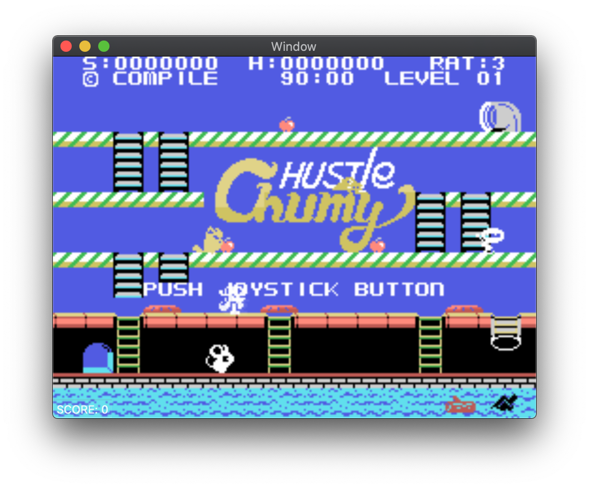
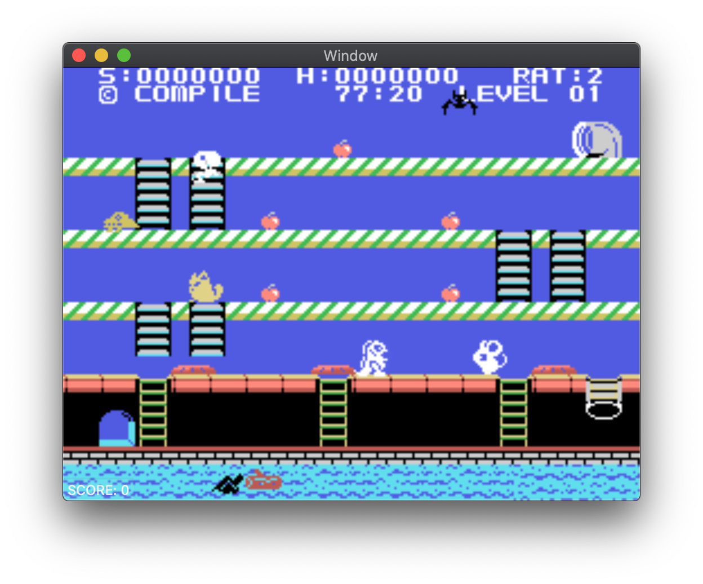

# [WIP] TinyMSX

|          Screenshot 1           |          Screenshot 2           |
| :-----------------------------: | :-----------------------------: |
|  |  |

## WIP status

- [x] Emulate SG-1000
- [x] Emulate Othello Multivision (note: some input port are ignored)
- [ ] Emulate MSX (cartridge games only and there are several restrictions)

## What is TinyMSX

TinyMSX is not MSX.
TinyMSX is a minimal hardware & software configuration MSX compatible to run MSX cartridge software based on SG-1000 emulator.
The goal of this project is to provide a minimal C/C++ library to provide a range of MSX past assets that do not utilize the some of BIOS and hardwares in a standalone configuration that can be sold on Steam and others without BIOS implementation.

## How to use

### Basic usage

#### C++

```c++
#include "tinymsx.h"
```

```c++
    // Create an instance
    TinyMSX msx(TINYMSX_TYPE_MSX1, rom, romSize, TINYMSX_COLOR_MODE_RGB555);

    // Reset
    msx.reset();

    // Execute 1 frame
    msx.tick(0, 0);

    // Get display buffer (256 x 192 x 2 bytes)
    unsigned short* display = msx.display;

    // Get and clear the buffered audio data (44.1Hz/16bit/2ch) by tick execution.
    size_t soundSize;
    void* soundBuffer = msx.getSoundBuffer(&soundSize);

    // State save (quick save)
    size_t stateSize;
    const void* stateData = msx.saveState(&stateSize);

    // State load (quick load)
    msx.loadState(stateData, stateSize);
```

#### C

```c
#include "tinymsx_gw.h"
```

```c
    void* msx;
    unsigned short* display
    size_t soundSize;
    void* soundBuffer;
    size_t stateSize;
    const void* stateData;

    /* Create an instance */
    msx = tinymsx_create(TINYMSX_TYPE_MSX1, rom, romSize, TINYMSX_COLOR_MODE_RGB555);

    /* Reset */
    tinymsx_reset(msx);

    /* Execute 1 frame */
    tinymsx_tick(msx, 0, 0);

    /* Get display buffer (256 x 192 x 2 bytes) */
    display = tinymsx_display(msx);

    /* Get and clear the buffered audio data (44.1Hz/16bit/2ch) by tick execution. */
    soundBuffer = tinymsx_sound(msx, &soundSize);

    /* State save (quick save) */
    stateData = tinymsx_save(msx, &stateSize);

    /* State load (quick load) */
    tinymsx_load(msx, stateData, stateSize);

    /* Destroy an instance */
    tinymsx_destroy(msx);
```
