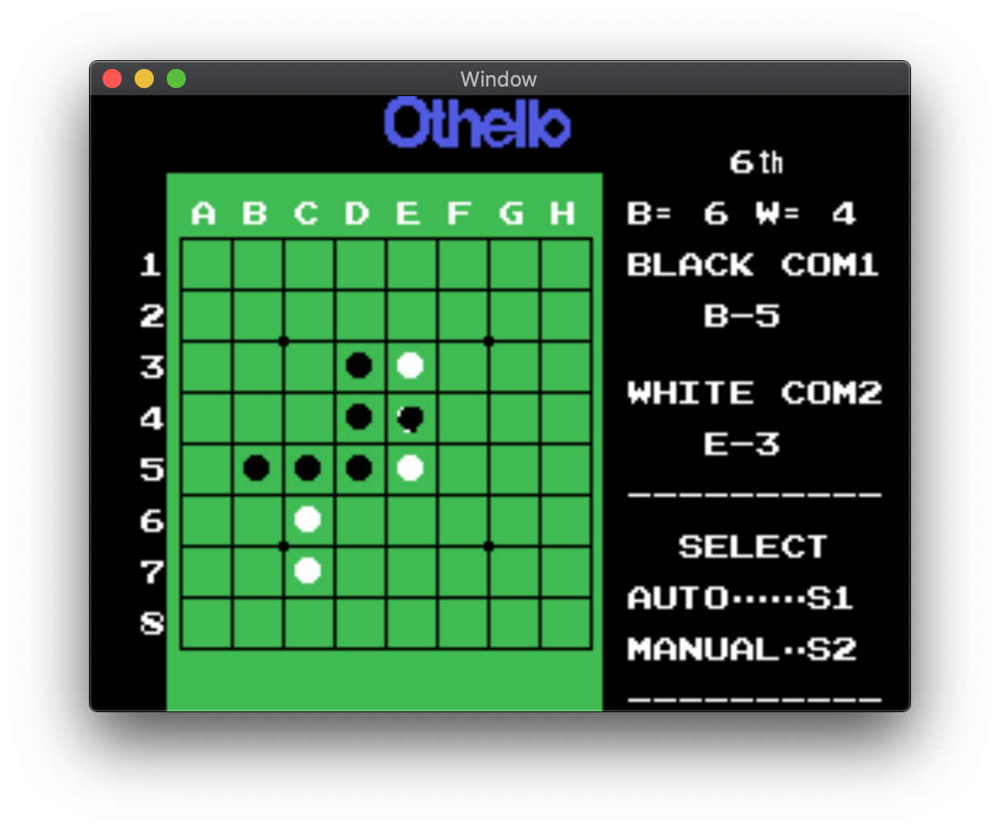
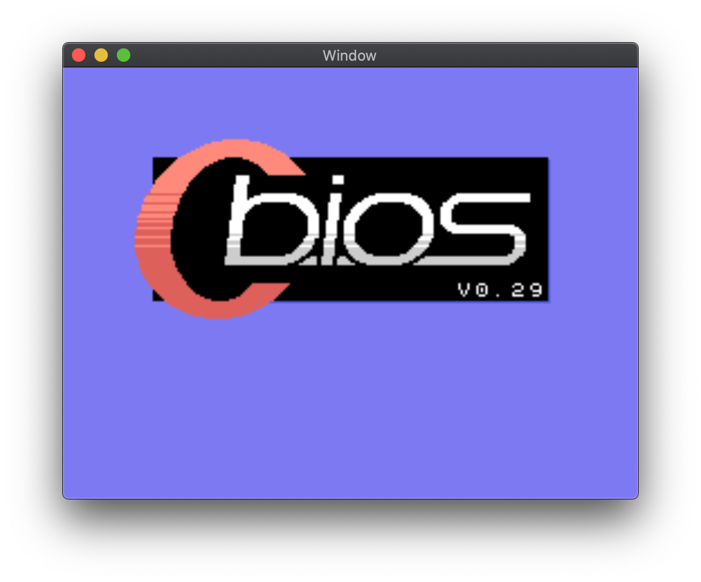

# TinyMSX

TinyMSX is a multi-emulator core library for C/C++ that supports following game consoles:

- SG-1000
- TSUKUDA ORIGINAL Othello MultiVision
- MSX1 16KB or 32KB cartridge games

|                   SG-1000                   |             Othello MultiVision              |                  MSX1                  |
| :-----------------------------------------: | :------------------------------------------: | :------------------------------------: |
|  |  |  |

## How to use

### Basic usage

```c++
#include "tinymsx.h"
```

```c++
    // Create an instance
    TinyMSX msx(TINYMSX_TYPE_MSX1, rom, romSize, TINYMSX_COLOR_MODE_RGB555);

    // Load main BIOS of MSX1
    msx.loadBiosFromFile("/path/to/main-bios.rom");

    // Reset
    msx.reset();

    // Execute 1 frame
    msx.tick(0, 0);

    // Get display buffer (256 x 192 x 2 bytes)
    unsigned short* display = msx.vdp.display;

    // Get and clear the buffered audio data (44.1Hz/16bit/2ch) by tick execution.
    size_t soundSize;
    void* soundBuffer = msx.getSoundBuffer(&soundSize);

    // State save (quick save)
    size_t stateSize;
    const void* stateData = msx.saveState(&stateSize);

    // State load (quick load)
    msx.loadState(stateData, stateSize);
```

### Example

- [for macOS (Cocoa)](test/osx)

## License

[MIT](LICENSE.txt)
