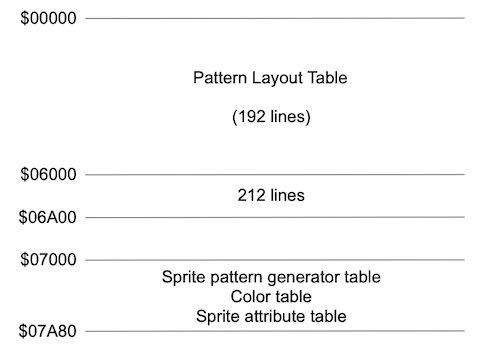

# V9938 MSX-VIDEO

## 本書について

V9938（MSX-VIDEO, E-VDP-I）は、アスキー、マイクロソフト、ヤマハ の 3 社で開発され MSX2 で採用された Video Display Processor (VDP) です。
MSX1 (TMS9918A) と比べて、ハイレゾなビットマップ表示やテキスト表示機能など "パソコン向け" を意識された機能が大幅に強化された一方、ゲーム向きの機能は小さなエンハンスに留まっている特徴があります。

> ヤマハは後にゲーム機（セガマーク III）向けに特化した 315-5124 と呼ばれる VDP を開発しています。
> 315-5124 は、ゲーム機向けには冗長な機能が多い V9938 ではなく、TMS9918A ベースで再設計されています。

本書は Eugeny Brychkov 氏によるドキュメント [V9938-programmers-guide.pdf](http://rs.gr8bit.ru/Documentation/V9938-programmers-guide.pdf) - Rev. 1.01c (Apr 10, 2018) をベースに作成しました。
純粋な邦訳ではなく、所々意訳したり再編しています。

## 目次

```text
1. BASIC INPUT AND OUTPUT
  1.1. Accessing the Control Registers
    1.1.1. Direct access to VDP registers
    1.1.2. Indirect access to registers through R#17 (Control Register Pointer)
  1.2. Accessing the Palette Registers
  1.3. Accessing the Status Registers
  1.4. Accessing the Video RAM
2. REGISTER FUNCTIONS
  2.1. Control registers
    2.1.1. Mode registers
    2.1.2. Table Base address registers
    2.1.3. Color registers
    2.1.4. Display registers
    2.1.5. Access registers
    2.1.6. Command registers
  2.2. Status registers #0 to #9
    2.2.1. Status register #0
    2.2.2. Status register #1
    2.2.3. Status register #2
    2.2.4. Status register #3 ~ #6
    2.2.5. Status register #7
    2.2.6. Status register #8 ~ #9
3. SCREEN MODES
  3.1. TEXT1 mode
  3.2. TEXT2 mode
  3.3. MULTICOLOR (MC) mode
  3.4. GRAPHIC1 (G1) mode
  3.5. GRAPHIC2 (G2) and GRAPHIC3 (G3) modes
  3.6. GRAPHIC4 (G4) mode
  3.7. GRAPHIC5 (G5) mode
  3.8. GRAPHIC6 (G6) mode
  3.9. GRAPHIC7 (G7) mode
4. COMMANDS
  4.1. Types of Commands
  4.2. Page concept
  4.3. Logical Operations
  4.4. Explanations of Commands
    4.4.1. HMMC (High-speed move CPU to VRAM)
    4.4.2. YMMM (High speed move VRAM to VRAM, y only)
    4.4.3. HMMM (High speed move VRAM to VRAM)
    4.4.4. HMMV (High-speed move VDP to VRAM)
    4.4.5. LMMC (Logical move CPU to VRAM)
    4.4.6. LMCM (Logical move VRAM to CPU)
    4.4.7. LMMM (Logical move VRAM to VRAM)
    4.4.8. LMMV (logical move VDP to VRAM)
    4.4.9. LINE
    4.4.10. SRCH
    4.4.11. PSET
    4.4.12. POINT
  4.5. Speeding up the processing of commands
  4.6. States of the registers after command execution
5. SPRITES
  5.1. Sprite mode 1 (G1, G2, MC)
  5.2. Sprite mode 2 (G3, G4, G5, G6, G7)
  5.3. Special rules for sprite color settings
6. SPECIAL FUNCTIONS
  6.1. Alternate display of two graphics screen pages
  6.2. Displaying two graphics screens at 60Hz
  6.3. Interlace display
```

## 1. BASIC INPUT AND OUTPUT

V9938 の基本入出力は [TMS9918A](TMS9918A.md) の上位互換ですが、[TMS9918A](TMS9918A.md) の未使用領域を使うため、完全な互換性はありません。
そのため、TMS9918A の undocumented な方法や一部のマイナーな機能を使用している MSX1 のプログラムは、MSX2 では正常に動作しない可能性があります。

### 1.1. Accessing the Control Registers

V9938 は ポート#0 ～ ポート#3 の 4 つのポートを持ちます:

- ポート#0 ($98)
  - VRAM Data (R/W)
- ポート#1 ($99)
  - Status Register (R)
  - VRAM Address (W)
  - Register set-up (W)
- ポート#2 ($9A)
  - Palette registers (W)
- ポート#3 ($9B)
  - Register indirect addressing (W)

MSX-VIDEO コントロールレジスタ（R#0 ～ R#46）にデータを設定する方法は 2 通りあります。

#### 1.1.1. Direct access to VDP registers

ポート#1 にデータとレジスタ番号を順番に出力します。
VDP ポートへの読み書きの順番は非常に重要なので、この順番は、VDP ポートへの書き込みや読み出しが可能な CPU の割り込みルーチンによって中断される可能性があることを覚えておく必要があり、その結果、適切なシーケンスが中断されます。
Z80 CPU の場合は、開始時に DI(割り込み禁止) を使用し、VDP の最後に EI(割り込み許可) を使用してアクセスコードを設定してください。

データバイトが先に書き込まれ（ビット D0 ～ D7）、データバイトの隣にレジスタ番号が書き込まれます（ビット R0 ～ R5）。
この 2 つの動作の間に VDP 動作を伴う割り込みが発生した場合、予測できない結果が発生する可能性があります。

| Sequence            | Bit-7 | Bit-6 | Bit-5 | Bit-4 | Bit-3 | Bit-2 | Bit-1 | Bit-0 | Description     |
| :------------------ | :---: | :---: | :---: | :---: | :---: | :---: | :---: | :---: | :-------------- |
| Port #1 first byte  |  D7   |  D6   |  D5   |  D4   |  D3   |  D2   |  D1   |  D0   | Data            |
| Port #1 second byte |   1   |   0   |  R5   |  R4   |  R3   |  R2   |  R1   |  R0   | Register number |

#### 1.1.2. Indirect access to registers through R#17 (Control Register Pointer)

R#17 にダイレクトアドレッシングでレジスタ番号を設定し、ポート#3 にデータを送信します。
R#17 に書き込まれた値の MSB(AII)は、レジスタ番号のオートインクリメントを制御します。

- オートインクリメントが有効になっている場合: 各データの読み出しまたは書き込み後に制御レジスタのポインタがインクリメントされる
- オートインクリメントが無効になっている場合: R#17 のポインタの値は変更されないままになります

オートインクリメントモードは、VDP レジスタの一括読み出しや更新に便利です。

| Sequence     | Bit-7 | Bit-6 | Bit-5 | Bit-4 | Bit-3 | Bit-2 | Bit-1 | Bit-0 | Description     |
| :----------- | :---: | :---: | :---: | :---: | :---: | :---: | :---: | :---: | :-------------- |
| Register #17 |  AII  |   0   |  R5   |  R4   |  R3   |  R2   |  R1   |  R0   | Register number |
| Port #3      |  D7   |  D6   |  D5   |  D4   |  D3   |  D2   |  D1   |  D0   | Data            |

- AII (auto increment) 0 = enable, 1 = disable

### 1.2. Accessing the Palette Registers

MSX-VIDEO のパレットレジスタ(P#0 ～ P#15)にデータを設定するには、まずレジスタ R#16(カラーパレットアドレスポインター)にパレットレジスタ番号を設定してから、ポート #2 に 2 バイトのデータ(特定の順番で)を書き込む必要があります。
各色は赤、緑、青の 3 つのビット（値 0 ～ 7）で構成されています。

> - 注 1: ポート#2 にデータを書き込んだ後、レジスタ R#16 のパレットレジスタ番号(ポインタ)がオートインクリメントされます。
> - 注 2: ポート#2 のラッチはポート#1 のラッチと共用されるかが不明（SMS の VDP の場合は共用されている）

| Sequence            | Bit-7 | Bit-6 | Bit-5 | Bit-4 | Bit-3 | Bit-2  | Bit-1  | Bit-0  | Description    |
| :------------------ | :---: | :---: | :---: | :---: | :---: | :----: | :----: | :----: | :------------- |
| Register #16        |   0   |   0   |   0   |   0   |  P3   |   P2   |   P1   |   P0   | Palette number |
| Port #2 first byte  |   0   | Red2  | Red1  | Red0  |   0   | Blue2  | Blue1  | Blue0  | Color (RB)     |
| Port #2 second byte |   0   |   0   |   0   |   0   |   0   | Green2 | Green1 | Green0 | Color (G)      |

### 1.3. Accessing the Status Registers

MSX-VIDEO のステータスレジスタ（S#0 ～ S#9）を読み出すには、まず R#15（ステータスレジスタポインタ）にレジスタ番号を設定し、ポート#1 からデータを読み出す必要があります。

| Sequence             | Bit-7 | Bit-6 | Bit-5 | Bit-4 | Bit-3 | Bit-2 | Bit-1 | Bit-0 | Description   |
| :------------------- | :---: | :---: | :---: | :---: | :---: | :---: | :---: | :---: | :------------ |
| Register #15 (write) |   0   |   0   |   0   |   0   |  S3   |  S2   |  S1   |  S0   | Status number |
| Port #1 data (read)  |  D7   |  D6   |  D5   |  D4   |  D3   |  D2   |  D1   |  D0   | Status        |

### 1.4. Accessing the Video RAM (VRAM)

128K バイトの VRAM に 64K バイトの拡張 RAM を加えたものを VDP に装着することができます。

メモリにアクセスするには、以下の手順で行います。

1. R#45 write: 各バンク（VRAM または拡張 RAM）を切り替え
2. R#14 write: アドレスカウンタ A16 ~ A14 を設定
3. Port#1 write: アドレスカウンタ A7 ~ A0 と A13 ~ A8 を設定 & 以降のデータコマンドの read or write を設定
4. Port#0 read/write: データコマンド（メモリへのデータの読み書き）

Step 4 (Port#0 read/write) を実行する毎に VRAM アドレスがインクリメントされます。

| Sequence             | Bit-7 | Bit-6 | Bit-5 | Bit-4 | Bit-3 | Bit-2 | Bit-1 | Bit-0 | Description        |
| :------------------- | :---: | :---: | :---: | :---: | :---: | :---: | :---: | :---: | :----------------- |
| R#45                 |   0   |  MXC  | (MXD) | (MXS) | (DIY) | (DIX) | (EQ)  | (MAJ) | Argument register  |
| Register #14         |   0   |   0   |   0   |   0   |   0   |  A16  |  A15  |  A14  | VRAM address       |
| Port #1 first byte   |  A7   |  A6   |  A5   |  A4   |  A3   |  A2   |  A1   |  A0   | VRAM address       |
| Port #1 second byte  |   0   |  R/W  |  A13  |  A12  |  A11  |  A10  |  A9   |  A8   | VRAM address & R/W |
| Port #0 (read/write) |  D7   |  D6   |  D5   |  D4   |  D3   |  D2   |  D1   |  D0   | VRAM data          |

- MXC: 0 = VRAM, 1 = 拡張 RAM
- R/W: 0 = Read, 1 = Write

## 2. REGISTER FUNCTIONS

### 2.1. Control registers

R#0 ~ R#23, R#32 ~ R#46 が制御レジスタです。

#### 2.1.1. Mode registers

| Register | Bit-7 | Bit-6 | Bit-5 | Bit-4 | Bit-3 | Bit-2 | Bit-1 | Bit-0 | Description   |
| :------- | :---: | :---: | :---: | :---: | :---: | :---: | :---: | :---: | :------------ |
| R#0      |   0   |  DG   |  IE2  |  IE1  |  M5   |  M4   |  M3   |   0   | Mode register |
| R#1      |   0   |  BL   |  IE0  |  M1   |  M2   |   0   |  SI   |  MAG  | Mode register |
| R#8      |  MS   |  LP   |  TP   |  CB   |  VR   |   0   |  SPD  |  BW   | Mode register |
| R#9      |  LN   |   0   |  S1   |  S0   |  IL   |  EO   | \*NT  |  DC   | Mode register |

\* Indicates negative logic

- R#0
  - **DG:** デジタイズモード: カラーバスを入力または出力モードに設定します
  - **IE2:** ライトペンからの割り込みを有効にする
  - **IE1:** 水平リトレースからの割り込みを有効にする
  - **M5~M3:** 画面モードフラグ ([3. SCREEN MODES](#3-screen-modes) を参照)
- R#1:
  - **BL:** 空白画面: 1 に設定すると画面表示が有効になります。0 に設定すると、画面表示は無効となり、VRAM の読み出し操作は行われません。
  - **IE0:** 垂直リトレースからの割り込みを有効にする
  - **M2~M1:** 画面モードフラグ ([3. SCREEN MODES](#3-screen-modes) を参照)
  - **SI:** スプライトサイズ: 1 に設定するとスプライトサイズは 16x16 になります．0 にするとスプライトサイズは 8x8 になります
  - **MAG:** スプライトの拡大: 1 に設定するとスプライトを拡大（2 倍）します
- R#8:
  - **MS:** マウス: 1 に設定すると、カラーバスを入力モードに設定してマウスを有効にします。0 に設定すると、カラーバスを出力モードに設定してマウスを無効にします。
  - **LP:** ライトペン: 1 に設定すると、ライトペンを有効にします。
  - **TP:** コード 0 の色をパレットの色に設定します
  - **CB:** カラーバス: 1 に設定すると、カラーバスを入力モードにします。0 に設定すると、カラーバスを出力モードにします。
  - **VR:** VRAM の種類と構成を選択します。1 に設定すると、VRAM は 64Kx1Bit または 64Kx4Bits になります。0 に設定すると、VRAM は 16Kx1Bit または 16Kx4Bits になります。VDP が DRAM チップ上でどのようにリフレッシュを実行するかに影響します。
  - **SPD:** スプライト無効化: 1 に設定するとスプライトが表示されず，関連する VRAM の読み込みも行われなくなります
  - **BW:** 黒/白: 1 に設定されている場合、画面出力が 32 階調のグレースケールになります
- R#9:
  - **LN:** Line: 1 に設定すると、垂直方向のドット数が 212 になります。0 に設定すると、垂直方向のドット数は 192 になります。
  - **S1~S0:** 同時モードを選択します。
  - **IL:** インターレース: 1 に設定するとインターレース、0 に設定するとノンインターレースモードになります。
  - **EO:** 偶数/奇数画面。1 に設定すると、偶数/奇数フィールドで 2 つのグラフィック画面を交互に表示し、0 に設定すると、同じグラフィック画面を偶数/奇数フィールドで表示します。
  - **\*NT:** (RGB 出力のみ) 1 に設定すると PAL モード (313 スキャンライン & 50Hz)、0 に設定すると NTSC モード (262 スキャンライン & 60Hz) になります。
  - **DC:** ドットクロック: 1 に設定すると \*DLCLK が入力モード、0 に設定すると \*DLCKL が出力モードになります。

#### 2.1.2. Table Base address registers

VDP は、画面に情報を表示する際に、ビデオ RAM からカラー、パターン、スプライトなどの情報を使用します。
指定されたテーブル・ベース・アドレス・レジスタに書き込むことで、このような VRAM の場所の適切な開始アドレスを設定することが重要です。

**注:** 未使用のビットは必ず 0 に設定します。
さらに本書で "0"　に設定されたビットは 0 に設定しなければならないことを意味し、"1" はこのビットを 1 に設定しなければならないことを意味し、"\*" はそのビットの値が重要でないことを意味します。

| Register | Bit-7 | Bit-6 | Bit-5 | Bit-4 | Bit-3 | Bit-2 | Bit-1 | Bit-0 | Description                    |
| :------- | :---: | :---: | :---: | :---: | :---: | :---: | :---: | :---: | :----------------------------- |
| R#2      |   0   | PL16  | PL15  | PL14  | PL13  | PL12  | PL11  | PL10  | Pattern layout table           |
| R#3      | CT13  | CT12  | CT11  | CT10  |  CT9  |  CT8  |  CT7  |  CT6  | Color table (low)              |
| R#10     |   0   |   0   |   0   |   0   |   0   | CT16  | CT15  | CT14  | Color table (high)             |
| R#4      |   0   |   0   | PG16  | PG15  | PG14  | PG13  | PG12  | PG11  | Pattern generator table        |
| R#5      | SA14  | SA13  | SA12  | SA11  | SA10  |  SA9  |  SA8  |  SA7  | Sprite attribute table (low)   |
| R#10     |   0   |   0   |   0   |   0   |   0   |   0   | SA16  | SA15  | Sprite attribute table (high)  |
| R#6      |   0   |   0   | SG16  | SG15  | SG14  | SG13  | SG12  | SG11  | Sprite pattern generator table |

#### 2.1.3. Color registers

Color registers are used to control MSX-VIDEO text and background screen colors, blinking and other functions.

| Register | Bit-7 | Bit-6 | Bit-5 | Bit-4 | Bit-3 | Bit-2 | Bit-1 | Bit-0 | Description                     |
| :------- | :---: | :---: | :---: | :---: | :---: | :---: | :---: | :---: | :------------------------------ |
| R#7      |  TC3  |  TC2  |  TC1  |  TC0  |  BD3  |  BD2  |  BD1  |  BD1  | Text and screen margin color    |
| R#12     |  T23  |  T22  |  T21  |  T20  |  BC3  |  BC2  |  BC1  |  BC0  | Text and background blink color |
| R#13     |  ON3  |  ON2  |  ON1  |  ON0  |  OF3  |  OF2  |  OF1  |  OF0  | Blinking period register        |
| R#20     |   0   |   0   |   0   |   0   |   0   |   0   |   0   |   0   | Color burst register 1          |
| R#21     |   0   |   0   |   1   |   1   |   1   |   0   |   1   |   1   | Color burst register 2          |
| R#22     |   0   |   0   |   0   |   0   |   0   |   1   |   0   |   1   | Color burst register 3          |

- **TC\*:** TEXT1 と TEXT2 モードでのテキストの色
- **BD\*:** 画面の余白 / 背景色
- **T2\*:** Color part 1
- **BC\*:** Color part 2
- **ON\*:** 偶数ページの表示時間
- **OF\*:** 奇数ページの表示時間

備考:

- TEXT2 モードでは、ブリンク用の属性がレジスタ R#7 の場合、交互に表示（ブリンク）します。
- TEXT2 モードと GRAPHIC4 ～ GRAPHIC7 のビットマップモードでは、2 ページを交互に表示（ブリンク）することができます
  - ブリンクを開始するには、このレジスタ R#13 に書き込みます。
- カラーバーストレジスタ (R#20 ~ R#22) の値は電源投入時にプリセットされています
  - 3 つのレジスタの全てのビットが 0 になっている場合、コンポジットビデオのカラーバーストは行われません
  - 既定値に戻すと、VDP は通常のカラーバースト信号の生成を開始します

#### 2.1.4. Display registers

##### (Display adjust)

表示レジスタは、画面上の表示位置を制御するために使用されます。

| Register | Bit-7 | Bit-6 | Bit-5 | Bit-4 | Bit-3 | Bit-2 | Bit-1 | Bit-0 | Description             |
| :------- | :---: | :---: | :---: | :---: | :---: | :---: | :---: | :---: | :---------------------- |
| R#18     |  V3   |  V2   |  V1   |  V0   |  H3   |  H2   |  H1   |  H0   | Display adjust register |

レジスタ#18 は、画面上の水平・垂直方向のアライメントを制御します。
下の表を参照してください。

| H/V |  7   |  6  |  5  |  4  |  3  |  2  |  1  |   0    | 15  | 14  | 13  | 12  | 11  | 10  |  9  |   8    |
| :-: | :--: | :-: | :-: | :-: | :-: | :-: | :-: | :----: | :-: | :-: | :-: | :-: | :-: | :-: | :-: | :----: |
|  H  | Left |  -  |  -  |  -  |  -  |  -  |  -  | Center |  -  |  -  |  -  |  -  |  -  |  -  |  -  | Right  |
|  V  | Top  |  -  |  -  |  -  |  -  |  -  |  -  | Center |  -  |  -  |  -  |  -  |  -  |  -  |  -  | Bottom |

##### (Vertical offset)

| Register | Bit-7 | Bit-6 | Bit-5 | Bit-4 | Bit-3 | Bit-2 | Bit-1 | Bit-0 | Description             |
| :------- | :---: | :---: | :---: | :---: | :---: | :---: | :---: | :---: | :---------------------- |
| R#23     |  DO7  |  DO6  |  DO5  |  DO4  |  DO3  |  DO2  |  DO1  |  DO0  | Verticaloffset register |

- R#23 は、画面に表示する 1 行目の位置を設定します。
- 仮想画面サイズは 256 行で、レジスタ R#9 の LN ビットに応じて 192 または 212 の縦画面サイズが表示されます。
- R#23 を 0 以外の値に設定すると、初期化されていない部分が表示され、ゴミのように見える場合があります。
- 仮想画面の表示は周期的に行われ、R#23 の値を上げると仮想画面の先頭が可視画面の下に表示されます。

##### (Interrupt line)

| Register | Bit-7 | Bit-6 | Bit-5 | Bit-4 | Bit-3 | Bit-2 | Bit-1 | Bit-0 | Description             |
| :------- | :---: | :---: | :---: | :---: | :---: | :---: | :---: | :---: | :---------------------- |
| R#23     |  IL7  |  IL6  |  IL5  |  IL4  |  IL3  |  IL2  |  IL1  |  IL0  | Interrupt line register |

- VDP はレジスタ R#0 の Bit-4 (IE1) が 1 に設定されている場合、各スキャンラインの表示を開始すると割り込みを発生させます。
- R#19 に値を書き込み、VDP が指定された行の表示を開始すると、ステータスレジスタ S#1 の Bit-0 (FH) を 1 に設定します。
- ステータスレジスタ S#1 の Bit-0 (FH) は、読み出すとリセットされます。

#### 2.1.5. Access registers

- **R#14:** [1.4. Accessing the Video RAM (VRAM)](#14-accessing-the-video-ram-vram)
- **R#15:** [1.3. Accessing the Status Registers](#13-accessing-the-status-registers)
- **R#16:** [1.2. Accessing the Palette Registers](#12-accessing-the-palette-registers)
- **R#17:** [1.1.2. Indirect access to registers through R#17 (Control Register Pointer)](#112-indirect-access-to-registers-through-r17-control-register-pointer)

#### 2.1.6. Command registers

MSX-VIDEO でコマンドを実行する場合、以下のコマンドレジスタを使用します。
これらのコマンドレジスタの使用方法については後述します。

| Register | Bit-7 | Bit-6 | Bit-5 | Bit-4 | Bit-3 | Bit-2 | Bit-1 | Bit-0 | Description                    |
| :------- | :---: | :---: | :---: | :---: | :---: | :---: | :---: | :---: | :----------------------------- |
| R#32     |  SX7  |  SX6  |  SX5  |  SX4  |  SX3  |  SX2  |  SX1  |  SX0  | Source X low register          |
| R#33     |   0   |   0   |   0   |   0   |   0   |   0   |   0   |  SX8  | Source X high register         |
| R#34     |  SY7  |  SY6  |  SY5  |  SY4  |  SY3  |  SY2  |  SY1  |  SY0  | Source Y low register          |
| R#35     |   0   |   0   |   0   |   0   |   0   |   0   |  SY9  |  SY8  | Source Y high register         |
| R#36     |  DX7  |  DX6  |  DX5  |  DX4  |  DX3  |  DX2  |  DX1  |  DX0  | Destination X low register     |
| R#37     |   0   |   0   |   0   |   0   |   0   |   0   |   0   |  DX8  | Destination X high register    |
| R#38     |  DY7  |  DY6  |  DY5  |  DY4  |  DY3  |  DY2  |  DY1  |  DY0  | Destination Y low register     |
| R#39     |   0   |   0   |   0   |   0   |   0   |   0   |  DY9  |  DY8  | Destination Y high register    |
| R#40     |  NX7  |  NX6  |  NX5  |  NX4  |  NX3  |  NX2  |  NX1  |  NX0  | Number of dots X low register  |
| R#41     |   0   |   0   |   0   |   0   |   0   |   0   |   0   |  NX8  | Number of dots X high register |
| R#42     |  NY7  |  NY6  |  NY5  |  NY4  |  NY3  |  NY2  |  NY1  |  NY0  | Number of dots Y low register  |
| R#43     |   0   |   0   |   0   |   0   |   0   |   0   |  NY9  |  NY8  | Number of dots Y high register |
| R#44     |  CH3  |  CH2  |  CH1  |  CH0  |  CL3  |  CL2  |  CL1  |  CL0  | Color register                 |
| R#45     |   0   |  MXC  |  MXD  |  MXS  |  DIY  |  DIX  |  EQ   |  MAJ  | Argument register              |
| R#46     |  CM3  |  CM2  |  CM1  |  CM0  |  LO3  |  LO2  |  LO1  |  LO0  | Command register               |

### 2.2. Status registers #0 to #9

以下のステータス・レジスタは、VDP のステータスを報告するための読み取り専用レジスタです。

| Register | Bit-7 | Bit-6 | Bit-5 | Bit-4 | Bit-3 | Bit-2 | Bit-1 | Bit-0 | Description                                          |
| :------- | :---: | :---: | :---: | :---: | :---: | :---: | :---: | :---: | :--------------------------------------------------- |
| S#0      |  INT  |  5S   |   C   |  FS4  |  FS3  |  FS2  |  FS1  |  FS0  | [Status register #0](#221-status-register-0)         |
| S#1      |  FL   |  LPS  |  ID4  |  ID3  |  ID2  |  ID1  |  ID0  |  FH   | [Status register #1](#222-status-register-1)         |
| S#2      |  TR   |  VR   |  HR   |  BD   |   1   |   1   |  EO   |  CE   | [Status register #2](#223-status-register-2)         |
| S#3      |  X7   |  X6   |  X5   |  X4   |  X3   |  X2   |  X1   |  X0   | [Status register #3 ~ #6](#224-status-register-3--6) |
| S#4      |   1   |   1   |   1   |   1   |   1   |   1   |   1   |  X8   | [Status register #3 ~ #6](#224-status-register-3--6) |
| S#5      |  Y7   |  Y6   |  Y5   |  Y4   |  Y3   |  Y2   |  Y1   |  Y0   | [Status register #3 ~ #6](#224-status-register-3--6) |
| S#6      |   1   |   1   |   1   |   1   |   1   |   1   |  Y9   |  Y8   | [Status register #3 ~ #6](#224-status-register-3--6) |
| S#7      |  C7   |  C6   |  C5   |  C4   |  C3   |  C2   |  C1   |  C0   | [Status register #7](#225-status-register-7)         |
| S#8      |  BX7  |  BX6  |  BX5  |  BX4  |  BX3  |  BX2  |  BX1  |  BX0  | [Status register #8 ~ #9](#226-status-register-8--9) |
| S#9      |   1   |   1   |   1   |   1   |   1   |   1   |   1   |  BX8  | [Status register #8 ~ #9](#226-status-register-8--9) |

#### 2.2.1. Status register #0

- **INT:** 垂直スキャン割り込みフラグ（S#0 が読み込まれると、このフラグはリセットされる）
- **5S:** 5 番目 (Mode 1) or 9 番目 (Mode 2) のスプライト（表示されていない）を検出時に 1 になる
- **C:** スプライト衝突時に 1 になる
- **FS\*:** 5 番目 (Mode 1) or 9 番目 (Mode 2) のスプライト番号（5S がセット時のみ）

> - Sprite Mode 1 の場合, S#0 は TMS9918A のステータスフラグと同じ
> - Sprite Mode 2 の場合, 水平スプライト上限が 4 から 8 になる点が異なる

#### 2.2.2. Status register #1

- **FL:**
  - ライトペン: ライトペンが光を検出すると設定されます。IE2 がセットされていると割り込みが発生します。S#1 を読み込むとリセットされます。
  - マウス 2: マウスの第 2 ボタンが押された場合に設定されます。このフラグは、ステータスレジスタ S#1 を読み出してもリセットされません。
- **LPS:**
  - ライトペンボタン: ライトペンボタンを押したときに設定されます。
  - マウス 1: マウスの最初のボタンが押された場合に設定されます。
  - このフラグは、両方のセットアップでステータスレジスタ S#1 を読み出す際にはリセットされません。
- **ID\*:** VDP チップの識別番号
- **FH:** [(Interrupt line)](#interrupt-line)を参照

#### 2.2.3. Status register #2

- **TR:** 転送準備フラグ
  - 1: VDP が次の転送の準備ができている
  - 0: VDP は準備ができていない
- **VR:** 垂直リトレースフラグ
  - 画面の VBLANK 領域をスキャンしている間（つまり垂直方向のリトレース中に加えて、画面の上下の境界線を描画している間）に設定されます
- **HR:** 水平リトレースフラグ
  - 画面の HBLANK 領域の走査中（画面の左右の境界線が描画されている間）に設定されます
- **BD:** 色検出フラグ
  - 検索コマンドを実行したとき、指定された色が検出された場合に設定されます
- **EO:** ディスプレイ フィールド フラグ
  - 0: 1 番目のフィールドを表示中
  - 1: 2 番目のフィールドを表示中
- **CE:** コマンド実行フラグ
  - 0: VDP がコマンドが実行可能な状態
  - 1: VDP がコマンド実行中

#### 2.2.4. Status register #3 ~ #6

S#3 ~ S#6 には次の何れかの情報が格納される:

- スプライトの衝突位置
- ライトペンの位置
- マウスの相対移動

#### 2.2.5. Status register #7

S#7 (カラーレジスタ) は、コマンド "POINT" や "VRAM to CPU" を実行した時に VRAM データが格納されます。

#### 2.2.6. Status register #8 ~ #9

S#8 ~ S#9 は、検索コマンドが実行されてコード化された色が検出された時にその X 座標が格納されます。

## 3. SCREEN MODES

[R#0 と R#1](#211-mode-registers) の設定により以下 10 種類の画面モードを使用できます:

| M5  | M4  | M3  | M2  | M1  | Screen Mode                                           | Sprite | Pattern size | Patterns |    Screen size    | VRAM/screen |
| :-: | :-: | :-: | :-: | :-: | :---------------------------------------------------- | :----: | :----------: | :------: | :---------------: | :---------: |
|  0  |  0  |  0  |  0  |  1  | [TEXT1](#31-text1-mode)                               |  n/a   |   6x8 dots   |   256    |      240x192      |     4KB     |
|  0  |  1  |  0  |  0  |  1  | [TEXT2](#32-text2-mode)                               |  n/a   |   6x8 dots   |   256    | 480x192 / 480x212 |     8KB     |
|  0  |  0  |  0  |  1  |  0  | [MC: MULTI-COLOR](#33-multicolor-mc-mode)             | Mode 1 |     n/a      |   n/a    |      256x192      |     4KB     |
|  0  |  0  |  0  |  0  |  0  | [G1: GRAPHIC1](#34-graphic1-g1-mode)                  | Mode 1 |   8x8 dots   |   256    |      256x192      |     4KB     |
|  0  |  0  |  1  |  0  |  0  | [G2: GRAPHIC2](#35-graphic2-g2-and-graphic3-g3-modes) | Mode 1 |   8x8 dots   |   768    |      256x192      |    16KB     |
|  0  |  1  |  0  |  0  |  0  | [G3: GRAPHIC3](#35-graphic2-g2-and-graphic3-g3-modes) | Mode 2 |   8x8 dots   |   768    |      256x192      |    16KB     |
|  0  |  1  |  1  |  0  |  0  | [G4: GRAPHIC4](#36-graphic4-g4-mode)                  | Mode 2 | 2 dots/byte  |   n/a    | 256x192 / 256x212 |    32KB     |
|  1  |  0  |  0  |  0  |  0  | [G5: GRAPHIC5](#37-graphic5-g5-mode)                  | Mode 2 | 4 dots/byte  |   n/a    | 512x192 / 512x212 |    32KB     |
|  1  |  0  |  1  |  0  |  0  | [G6: GRAPHIC6](#38-graphic6-g6-mode)                  | Mode 2 | 2 dots/byte  |   n/a    | 512x192 / 512x212 |    64KB     |
|  1  |  1  |  1  |  0  |  0  | [G7: GRAPHIC7](#39-graphic7-g7-mode)                  | Mode 2 |  1 dot/byte  |   n/a    | 256x192 / 256x212 |    64KB     |

以下の画面モードが [TMS9918A](TMS9918A.md) 互換モードです:

- [TMS9918A](TMS9918A.md) Mode 0 = G1
- [TMS9918A](TMS9918A.md) Mode 1 = TEXT1
- [TMS9918A](TMS9918A.md) Mode 2 = G2
- [TMS9918A](TMS9918A.md) Mode 3 = MC

### 3.1. TEXT1 mode

解説省略（[TMS9918A](TMS9918A.md) の Mode 1 と同じ）

### 3.2. TEXT2 mode

解説省略（ゲームではほぼ使われない筈なので実装しない予定）

### 3.3. MULTICOLOR (MC) mode

解説省略（[TMS9918A](TMS9918A.md) の Mode 3 と同じ）

### 3.4. GRAPHIC1 (G1) mode

解説省略（[TMS9918A](TMS9918A.md) の Mode 0 と同じ）

### 3.5. GRAPHIC2 (G2) and GRAPHIC3 (G3) modes

- G2: 解説省略（[TMS9918A](TMS9918A.md) の Mode 2 と同じ）
- G3: 解説省略（G2 のスプライトが Mode 2 になったもの）

### 3.6. GRAPHIC4 (G4) mode

G4 は Pattern layout table の 1 バイトで 2 ピクセル (1 行 128 bytes) x 行数（192 or 212）分のビットマップ形式の情報を持つグラフィックモードです。

以下のテーブルを参照します:

| Register |  Bit-7  |  Bit-6  |  Bit-5  |  Bit-4  | Bit-3 | Bit-2 | Bit-1 | Bit-0 | Description                    |
| :------- | :-----: | :-----: | :-----: | :-----: | :---: | :---: | :---: | :---: | :----------------------------- |
| R#2      |    0    |  PL16   |  PL15   |  PL14   | PL13  | PL12  | PL11  | PL10  | Pattern layout table           |
| R#3      |  CT13   |  CT12   |  CT11   |  CT10   |  CT9  |  CT8  |  CT7  |  CT6  | Color table (low)              |
| R#10     |    0    |    0    |    0    |    0    |   0   | CT16  | CT15  | CT14  | Color table (high)             |
| R#5      |  SA14   |  SA13   |  SA12   |  SA11   | SA10  |  SA9  |  SA8  |  SA7  | Sprite attribute table (low)   |
| R#10     |    0    |    0    |    0    |    0    |   0   |   0   | SA16  | SA15  | Sprite attribute table (high)  |
| R#6      |    0    |    0    |  SG16   |  SG15   | SG14  | SG13  | SG12  | SG11  | Sprite pattern generator table |
| R#7      | _unuse_ | _unuse_ | _unuse_ | _unuse_ |  BD3  |  BD2  |  BD1  |  BD1  | Text and screen margin color   |

Example VRAM map:



### 3.7. GRAPHIC5 (G5) mode

一旦解説省略（ゲームでの使用実績が少なければ実装も省略予定）

### 3.8. GRAPHIC6 (G6) mode

一旦解説省略（ゲームでの使用実績が少なければ実装も省略予定）

### 3.9. GRAPHIC7 (G7) mode

G7 は Pattern layout table の 1 バイトで 1 ピクセル (1 行 256 bytes) x 行数（192 or 212）分のビットマップ形式の情報を持つグラフィックモードです。

Pattern layout table の各バイトのビットレイアウトは次の通りです:

| Bit-7 | Bit-6 | Bit-5 | Bit-4 | Bit-3 | Bit-2 | Bit-1 | Bit-0 |
| :---: | :---: | :---: | :---: | :---: | :---: | :---: | :---: |
|  G2   |  G1   |  G0   |  R2   |  R1   |  R0   |  B1   |  B0   |

- **G2 ~ G0:** 緑色 (3bit)
- **R2 ~ R0:** 赤色 (3bit)
- **B1 ~ B0:** 青色 (2bit)

参照するテーブルは G4 と同様です。

## 4. COMMANDS

### 4.1. Types of commands

コマンドは、ビデオメモリ上で特定の複雑な操作を行い、画面に表示される画像を処理するために使用します。

使用可能なコマンドのリストを下表に示します。

| Command name    | Destination | Source | Unit |                        Mnemonic                         | CM3 | CM2 | CM1 | CM0 |
| :-------------- | :---------: | :----: | :--: | :-----------------------------------------------------: | :-: | :-: | :-: | :-: |
| High-speed move |    VRAM     |  CPU   | Byte |     [HMMC](#441-hmmc-high-speed-move-cpu-to-vram)\*     |  1  |  1  |  1  |  1  |
| High-speed move |    VRAM     |  VRAM  | Byte | [YMMM](#442-ymmm-high-speed-move-vram-to-vram-y-only)\* |  1  |  1  |  1  |  0  |
| High-speed move |    VRAM     |  VRAM  | Byte |     [HMMM](#443-hmmm-high-speed-move-vram-to-vram)      |  1  |  1  |  0  |  1  |
| High-speed move |    VRAM     |  VDP   | Byte |      [HMMV](#444-hmmv-high-speed-move-vdp-to-vram)      |  1  |  1  |  0  |  0  |
| Logical move    |    VRAM     |  CPU   | Dot  |       [LMMC](#445-lmmc-logical-move-cpu-to-vram)        |  1  |  0  |  1  |  1  |
| Logical move    |     CPU     |  VRAM  | Dot  |       [LMCM](#446-lmcm-logical-move-vram-to-cpu)        |  1  |  0  |  1  |  0  |
| Logical move    |    VRAM     |  VRAM  | Dot  |       [LMMM](#447-lmmm-logical-move-vram-to-vram)       |  1  |  0  |  0  |  1  |
| Logical move    |    VRAM     |  VDP   | Dot  |       [LMMV](#448-lmmv-logical-move-vdp-to-vram)        |  1  |  0  |  0  |  0  |
| Line            |    VRAM     |  VDP   | Dot  |                    [LINE](#449-line)                    |  0  |  1  |  1  |  1  |
| Search          |    VRAM     |  VDP   | Dot  |                   [SRCH](#4410-srch)                    |  0  |  1  |  1  |  0  |
| Pset            |    VRAM     |  VDP   | Dot  |                   [PSET](#4411-pset)                    |  0  |  1  |  0  |  1  |
| Point           |     VDP     |  VRAM  | Dot  |                  [POINT](#4412-point)                   |  0  |  1  |  0  |  0  |
| _Invalid_       |             |        |      |                                                         |  0  |  0  |  1  |  1  |
| _Invalid_       |             |        |      |                                                         |  0  |  0  |  1  |  0  |
| _Invalid_       |             |        |      |                                                         |  0  |  0  |  0  |  1  |
| Stop            |             |        |      |                          STOP                           |  0  |  0  |  0  |  0  |

\* G4、G6 モードでは下位 1 ビット、G5 モードでは下位 2 ビットが X 座標（DX, NX）に関連するレジスタで失われます。

VDP コマンドの実行プロセスは、いくつかのステップで構成されています。

- G4 ~ G7 でのみ利用できます (他のモードでは結果が保証されません)
- ステータスレジスタ S#2 の Bit-0 (CE、コマンド実行) フラグが 0 であることを確認します
  - 1 の場合は、前のコマンドが実行中のため、プログラムは完了を待つか STOP コマンドで実行を中止する必要があります
- 必要に応じてレジスタ R#32 ～ R#45 にコマンド実行に必要なパラメータを設定します
  - オートインクリメントを ON にした間接レジスタアドレッシングモードを使用することで、レジスタへの値の一括書き込みが容易になります
- R#46 (CMR、コマンドレジスタ) にコマンドコードを書き込む

### 4.2. Page concept

すでに見たように、プログラマはベースアドレスレジスタを変更することで、ビデオメモリにテーブルを配置するためのいくつかのオプションを持つことができます。
いくつかのモードでは、より多くのオプションがあります (例えば、Text 1 では 32 のオプションがあり、GRAPHICS7 では 2 つのオプションしかありません)。
ここでは、現在 VDP が動作している場所で定義されたページの概念と、ピクチャ表示のための情報をどこから取得するかを紹介します。

ページの概念は、VDP コマンドに関連してより厳密になっています。
VRAM アクセスは、VRAM 内の物理アドレスではなく、X と Y の座標で定義されます。

- 座標 X: 9 ビットで指定され 0 ～ 511 の範囲
- 座標 Y: 10 ビットで指定され、0 ～ 1023 の範囲

各種ビデオモードにおける VRAM のページングについては、下表を参照してください。

#### (G4 and G5)

|  VRAM address   |  Page  |  Position range in G4  |  Position range in G5  |
| :-------------: | :----: | :--------------------: | :--------------------: |
| $00000 ~ $07FFF | Page 0 |  (0, 0) - (255, 255)   |  (0, 0) - (511, 255)   |
| $08000 ~ $0FFFF | Page 1 | (0, 256) - (255, 511)  | (0, 256) - (511, 511)  |
| $10000 ~ $17FFF | Page 2 | (0, 512) - (255, 767)  | (0, 512) - (511, 767)  |
| $18000 ~ $1FFFF | Page 3 | (0, 768) - (255, 1023) | (0, 768) - (511, 1023) |

#### (G6 and G7)

|  VRAM address   |  Page  | Position range in G7  | Position range in G6  |
| :-------------: | :----: | :-------------------: | :-------------------: |
| $00000 ~ $0FFFF | Page 0 |  (0, 0) - (255, 255)  |  (0, 0) - (511, 255)  |
| $10000 ~ $1FFFF | Page 1 | (0, 256) - (255, 511) | (0, 256) - (511, 511) |

G4、G5 モードでは 4 ページ、G6、G7 モードでは 2 ページです。
例えば、G5 モードで Y 座標を 658 に設定すると、特定の翻訳された初期 VRAM アドレスを持つ 2 ページ目が自動的に選択されます。
VDP は最大 212 行まで表示可能であり、プログラマはレジスタ R#23 を使用してアクティブなページ内の可視スクリーン・ウィンドウの位置を設定するオプションがあることに注意してください。

### 4.3. Logical operations

LINE, PSET, Logical move コマンドを実行する際に、画素の色に対して行う論理演算を定義することができます。
論理演算を特定する 4 ビットは、コマンドレジスタ R#46 の下位 4 ビットに設定します。

| Mnemonic  | Operation                          | LO3 | LO2 | LO1 | LO0 |
| :-------: | :--------------------------------- | :-: | :-: | :-: | :-: |
|    IMP    | DC = SC                            |  0  |  0  |  0  |  0  |
|    AND    | DC = SC `AND` DC                   |  0  |  0  |  0  |  1  |
|    OR     | DC = SC `OR` DC                    |  0  |  0  |  1  |  0  |
|    XOR    | DC = SC `XOR` DC                   |  0  |  0  |  1  |  1  |
|    NOT    | DC = !SC                           |  0  |  1  |  0  |  0  |
| _Invalid_ |                                    |  0  |  1  |  0  |  1  |
| _Invalid_ |                                    |  0  |  1  |  1  |  0  |
| _Invalid_ |                                    |  0  |  1  |  1  |  1  |
|   TIMP    | `if SC != 0 then` DC = SC          |  1  |  0  |  0  |  0  |
|   TAND    | `if SC != 0 then` DC = SC `AND` DC |  1  |  0  |  0  |  1  |
|    TOR    | `if SC != 0 then` DC = SC `OR` DC  |  1  |  0  |  1  |  0  |
|   TXOR    | `if SC != 0 then` DC = SC `XOR` DC |  1  |  0  |  1  |  1  |
|   TNOT    | `if SC != 0 then` DC = !SC         |  1  |  1  |  0  |  0  |
| _Invalid_ |                                    |  1  |  1  |  0  |  1  |
| _Invalid_ |                                    |  1  |  1  |  1  |  0  |
| _Invalid_ |                                    |  1  |  1  |  1  |  1  |

- **SC:** Source Color code
- **DC:** Destination Color code

### 4.4. Explanations of Commands

#### 4.4.1. HMMC (High-speed move CPU to VRAM)

#### 4.4.2. YMMM (High speed move VRAM to VRAM, y only)

#### 4.4.3. HMMM (High speed move VRAM to VRAM)

#### 4.4.4. HMMV (High-speed move VDP to VRAM)

#### 4.4.5. LMMC (Logical move CPU to VRAM)

#### 4.4.6. LMCM (Logical move VRAM to CPU)

#### 4.4.7. LMMM (Logical move VRAM to VRAM)

#### 4.4.8. LMMV (logical move VDP to VRAM)

#### 4.4.9. LINE

#### 4.4.10. SRCH

#### 4.4.11. PSET

#### 4.4.12. POINT

(TODO)
